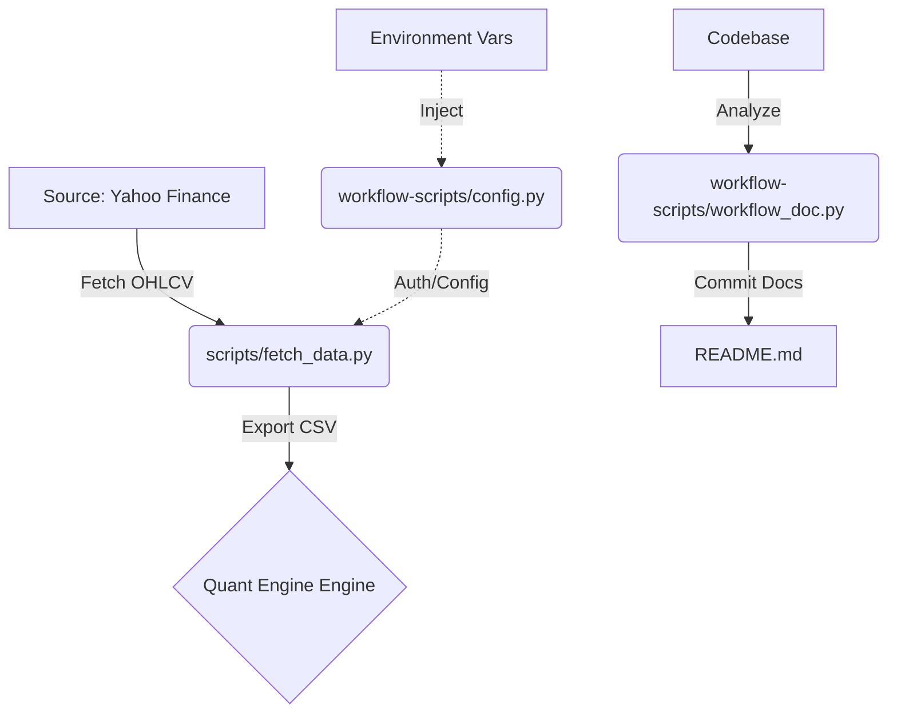

# Documentation du commit [4c5a60e]

> **Message du commit d'origine :** add: pipeline ai gen doc

# event-driven-quant-engine

## 🎯 Vue d'ensemble & Problématique
`event-driven-quant-engine` est une plateforme de calcul quantitatif haute performance conçue pour l'ingestion, le traitement et l'analyse de séries temporelles boursières. Le système résout le défi de la latence de préparation des données via un pipeline automatisé, garantissant une injection fluide de données historiques (OHLCV) vers un moteur de traitement en C++, tout en maintenant une documentation technique synchronisée avec l'évolution du code source.

## 🛠️ Stack Technique

| Catégorie | Technologie / Framework / Pattern | Rôle dans le projet |
| :--- | :--- | :--- |
| **Langage Core** | Python 3.11+ / C++ | Data Ingestion / Moteur de calcul |
| **Data Acquisition** | `yfinance` | Extraction de données boursières |
| **Automation & CI** | GitHub API / Gemini API | Auto-documentation & workflow |
| **Architecture** | Event-Driven / Modular | Isolation des responsabilités |
| **Config Management** | Dotenv / Sys Env | Sécurisation et injection de secrets |

## 🏗️ Architecture & Flux de Données



*   **Pipeline de données :** Le connecteur `fetch_data` normalise les flux externes en formats exploitables par le moteur C++.
*   **Decoupled Config :** L'injection dynamique via `config.py` assure que les clés API ne sont jamais hardcodées.
*   **Self-Documenting Code :** Le moteur de documentation utilise l'IA pour refléter en temps réel les changements de structure du projet.

## ⚙️ Composants Principaux & Modules

| Module / Dossier | Rôle Macro & Responsabilité | Composants Clés |
| :--- | :--- | :--- |
| `scripts/` | Pipeline de données opérationnel | `fetch_data.py` (Connecteur) |
| `workflow-scripts/` | Outillage DevOps et Maintenance | `config.py`, `workflow_doc.py` |
| `data/` | Stockage intermédiaire (Input) | CSV OHLCV |

> [!IMPORTANT]
> Le répertoire `workflow-scripts/` est critique pour le maintien de l'intégrité de la documentation. Toute modification structurelle importante doit déclencher `workflow_doc.py`.

## 🚀 Guide de Démarrage Rapide

> [!NOTE]
> L'exécution du moteur de calcul nécessite une configuration préalable de l'environnement Python et des bibliothèques de calcul numérique sur le système hôte.

### 🛠️ Prérequis
- Python 3.11+
- Accès API GitHub (pour le module de documentation)
- Clé API Gemini (pour la génération des résumés)

### 💻 Installation & Exécution
```bash
# 1. Cloner le projet
git clone https://github.com/votre-org/event-driven-quant-engine.git
cd event-driven-quant-engine

# 2. Installer les dépendances
pip install -r requirements.txt

# 3. Configurer l'environnement
cp .env.example .env
# Renseignez vos clés API dans le fichier .env

# 4. Lancer l'ingestion de données
python scripts/fetch_data.py --ticker AAPL --period 1y

# 5. Mettre à jour la documentation (si nécessaire)
python workflow-scripts/workflow_doc.py
```
