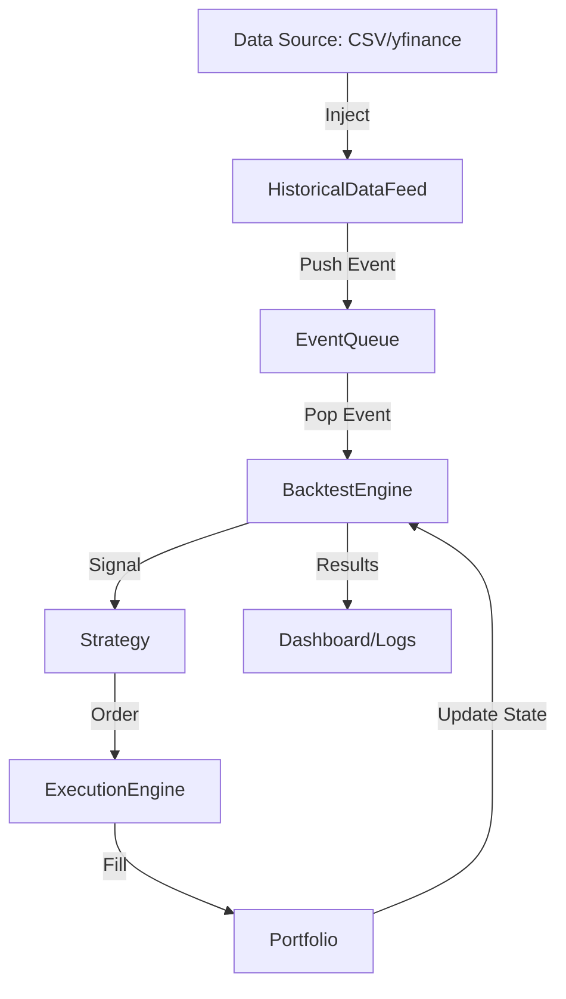

# Documentation du commit [58a28d9]

> **Message du commit d'origine :** Merge branch 'main' of https://github.com/FlorianDaunay/event-driven-quant-engine

# event-driven-quant-engine

## 🎯 Vue d'ensemble & Problématique
Ce moteur de backtesting événementiel haute performance offre une infrastructure robuste pour la simulation de stratégies de trading quantitatif. En découplant la gestion des données, l'exécution des ordres et la logique de valorisation d'options, il permet une évaluation précise des performances (PnL) et de la gestion des risques (Greeks) dans un environnement reproductible et modulaire.

## 🛠️ Stack Technique
| Catégorie | Technologie / Framework / Pattern | Rôle dans le projet |
| :--- | :--- | :--- |
| **Langage** | C++17 / Python 3.10+ | Core engine & scripts d'automatisation |
| **Frameworks** | Google Test (GTest) | Validation unitaire et fonctionnelle |
| **Architecture** | Event-Driven / Pub-Sub | Communication asynchrone entre modules |
| **Data API** | yfinance | Acquisition de données historiques |
| **Math / Quant** | Black-Scholes, Binomial Trees | Valorisation d'options et couverture Delta |

## 🏗️ Architecture & Flux de Données



*   **Bus d'événements centralisé :** La `EventQueue` (thread-safe) garantit une cohérence temporelle stricte.
*   **Boucle de simulation :** Le `BacktestEngine` orchestre le passage séquentiel du temps et des événements.
*   **Simulation réaliste :** L'`ExecutionEngine` applique le *slippage* et les commissions sur chaque ordre généré par la `Strategy`.

## ⚙️ Composants Principaux & Modules

| Module | Responsabilité Macro | Composants Critiques |
| :--- | :--- | :--- |
| `core/` | Infrastructure événementielle et types | `Event`, `EventQueue`, `Types` |
| `engine/` | Orchestration du backtest | `BacktestEngine` |
| `strategy/` | Logique d'investissement et couverture | `Strategy`, `DeltaHedgeStrategy` |
| `pricing/` | Modélisation mathématique | `BlackScholes`, `BinomialTree`, `ImpliedVol` |
| `execution/` | Simulation d'exécution de marché | `ExecutionEngine` |
| `portfolio/` | Tracking d'actifs et PnL | `Portfolio` |

> [!IMPORTANT]
> Les stratégies héritent de la classe abstraite `Strategy`, assurant une interopérabilité totale avec la `EventQueue` pour l'émission de signaux.

## 🚀 Guide de Démarrage Rapide

> [!NOTE]
> Prérequis système : Compilateur compatible C++17 (GCC 9+, Clang 10+), CMake 3.15+, et Python 3 pour les scripts d'extraction.

### 🛠️ Prérequis
- `CMake` (Build system)
- `Google Test` (installé via `apt`, `brew` ou `vcpkg`)
- `yfinance` (via `pip install yfinance`)

### 💻 Installation & Exécution
```bash
# 1. Cloner le projet
git clone https://github.com/votre-org/event-driven-quant-engine.git
cd event-driven-quant-engine

# 2. Préparer les données
python3 scripts/fetch_data.py --symbols AAPL,MSFT

# 3. Compiler le projet
mkdir build && cd build
cmake ..
make -j$(nproc)

# 4. Lancer le moteur de backtest
./bin/quant_engine_exec

# 5. Lancer la suite de tests
./tests/cpp/run_all_tests
```
